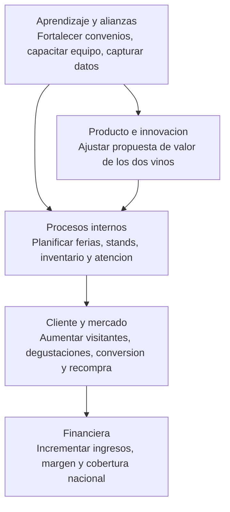
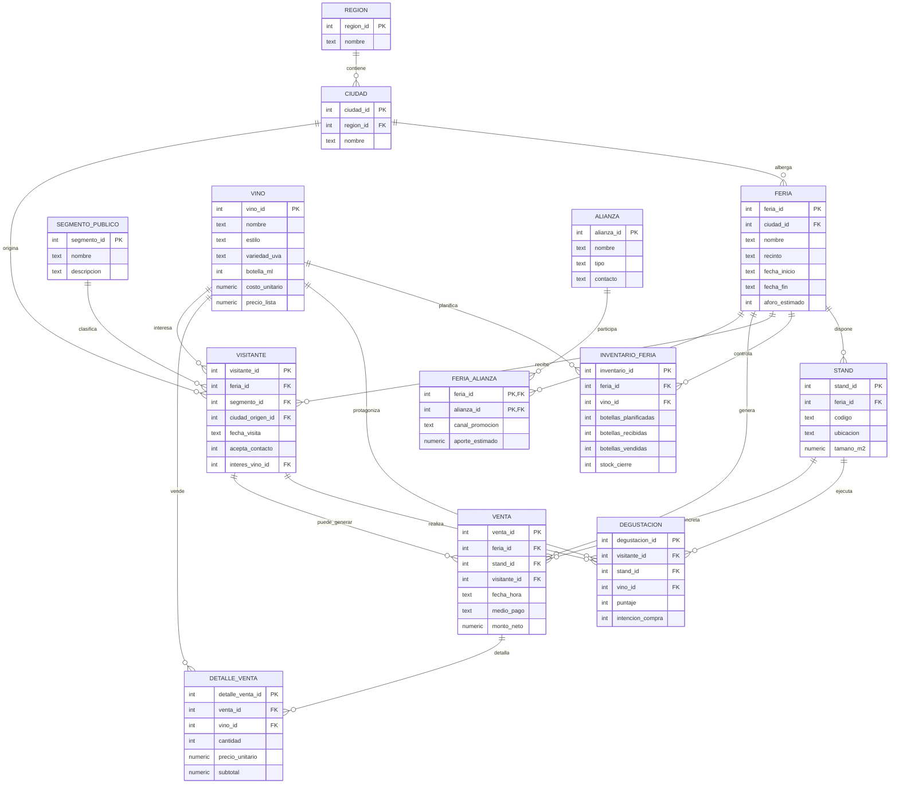

# Tarea 01 - INFO1184

## Proposito del documento

Este archivo corresponde a la documentacion academica de la `TA01`. Su funcion es responder lo solicitado en la tarea mediante explicaciones teoricas, analisis del caso, modelado conceptual y justificacion de la propuesta.

No debe leerse como manual tecnico de ejecucion. La guia operativa del proyecto se encuentra en `README_dbt.md`.

## Caso

Se propone una empresa vitivinicola chilena que producira y comercializara dos vinos:

- `Reserva Andes Carmenere`
- `Costa Blanca Sauvignon`

La empresa busca cobertura nacional, crecimiento rentable y mejor desempeno en el canal de ferias de vino para publico general, apoyada por alianzas estrategicas con actores del turismo, gastronomia y comercio.

## Parte I - Estrategia y cuadro de mando integral

### 1. Vision de la empresa

Ser una vitivinicola chilena reconocida a nivel nacional por ofrecer experiencias de vino memorables, con un portafolio corto pero diferenciado, capaz de crecer en ventas mediante ferias, alianzas comerciales y una operacion consistente en todo Chile.

Para alcanzar esa vision, la empresa necesita un sistema de inteligencia de negocios que permita medir el desempeno comercial en cada feria, evaluar la efectividad de las alianzas y orientar las decisiones de expansion con datos concretos en lugar de intuicion.

### 2. Foco de la empresa

El foco del negocio es posicionar dos vinos de alta rotacion y margen saludable en el mercado chileno, usando ferias como canal de exhibicion, degustacion, captura de leads y venta directa. La alianza estrategica permite amplificar la llegada a segmentos como turistas, restaurantes, hoteles y tiendas especializadas.

Desde la perspectiva de datos, este foco se traduce en medir la conversion de visitantes a compradores, la rentabilidad por feria y por vino, y la efectividad de cada alianza. Estos indicadores permiten decidir en que ferias participar, como distribuir el inventario y donde concentrar los esfuerzos comerciales.

### 3. Cinco procesos estrategicos por perspectiva

| Perspectiva | Proceso estrategico | Analisis aplicado al caso |
| --- | --- | --- |
| Financiera | Gestionar rentabilidad por feria | Cada feria debe justificar su costo con ventas, leads y visibilidad. La empresa debe medir ingresos, ticket promedio y costo por evento para decidir continuidad y expansion. |
| Cliente y mercado | Convertir degustaciones en ventas y recompra | La feria no solo exhibe el vino: tambien permite educar al visitante, captar preferencias y transformar interaccion en compra inmediata o seguimiento comercial posterior. |
| Procesos internos | Planificar stock, stand y operacion comercial | El exito de la feria depende de llegar con inventario correcto, montaje oportuno, personal preparado y control diario del desempeno del stand. |
| Producto e innovacion | Ajustar propuesta de valor de los dos vinos | Los dos vinos deben exhibirse con relato, maridaje y promociones coherentes. El aprendizaje del publico permite mejorar empaque, mensajes y ofertas. |
| Aprendizaje y alianzas | Activar alianzas y capitalizar informacion | Las alianzas aumentan trafico y credibilidad. La empresa debe capturar datos, aprender del publico y transferir ese aprendizaje a futuras ferias y canales. |

### 4. Mapa estrategico del negocio

Lectura del flujo:

- Las flechas suben desde capacidades habilitadoras hacia resultados financieros.
- Las alianzas y el aprendizaje alimentan la innovacion del producto y la calidad operativa.
- La buena operacion en feria mejora la experiencia del cliente.
- La mejora en cliente y mercado se traduce en ventas, margen y expansion.

### 5. Matriz 3M

#### Perspectiva financiera

| Medida | Meta | Medios |
| --- | --- | --- |
| Ingresos netos por feria | Superar CLP 250000 por feria | Definir promociones por caja y combos degustacion + compra |
| Ticket promedio | Alcanzar CLP 32000 | Venta asistida y packs mixtos de 2 o 6 botellas |
| Margen bruto por vino | Mantener margen bruto mayor a 45% | Control de costos, precios consistentes y alianzas para reducir promocion |

#### Perspectiva cliente y mercado

| Medida | Meta | Medios |
| --- | --- | --- |
| Conversion visitante a compra | Superar 30% | Guiar degustaciones y cerrar la venta en el mismo stand |
| Tasa de aceptacion de contacto | Superar 70% | Registro rapido de leads y beneficio por suscripcion |
| Recompra post feria | Lograr 15% de recompra en 60 dias | Seguimiento digital y ofertas para segmentos priorizados |

#### Perspectiva de procesos internos

| Medida | Meta | Medios |
| --- | --- | --- |
| Cumplimiento de stock planificado | Alcanzar 95% sin quiebres | Proyeccion de demanda por feria y reposicion diaria |
| Tiempo de montaje del stand | Completar antes de apertura en 100% de ferias | Checklist logistica y responsable por recinto |
| Exactitud del registro operativo | 100% de ventas y visitantes capturados | Base de datos unica y rutina diaria de validacion |

#### Perspectiva de producto e innovacion

| Medida | Meta | Medios |
| --- | --- | --- |
| Puntaje promedio de degustacion | Mantener nota mayor o igual a 4/5 | Relato de marca, maridaje y mejora de presentacion |
| Participacion del vino lider | Ningun vino bajo 40% del mix | Exhibicion balanceada y ofertas cruzadas |
| Nuevas propuestas comerciales probadas | Probar 2 acciones por trimestre | Ediciones limitadas, combos y material promocional segmentado |

#### Perspectiva de aprendizaje y alianzas

| Medida | Meta | Medios |
| --- | --- | --- |
| Ferias con alianza activa | 100% de las ferias | Convenios previos con turismo, horeca y comercio |
| Capacitacion del equipo comercial | 8 horas trimestrales | Guion de venta, argumentario y protocolo de registro |
| Hallazgos accionables por feria | Al menos 3 conclusiones por evento | Reunion post feria y tablero con KPI para decisiones |

## Parte II - Analisis y modelo de datos

### 1. Procesos mas importantes para el requerimiento

| Proceso | Objetivo | Salida esperada |
| --- | --- | --- |
| Planificacion de participacion en feria | Seleccionar feria, ciudad, aforo y alianzas | Calendario de eventos y presupuesto |
| Diseno del stand e inventario | Asignar stands, botellas y recursos | Inventario recibido por vino y feria |
| Atencion y degustacion | Registrar visitantes, segmento e interes | Historial de degustaciones y preferencias |
| Venta directa en feria | Registrar pagos y detalle de productos vendidos | Ventas por feria, stand, vino y visitante |
| Evaluacion post feria | Medir conversion, ingresos y efectividad de alianzas | KPI para decidir continuidad y mejoras |

### 2. Entidades identificadas

- `region`
- `ciudad`
- `segmento_publico`
- `vino`
- `alianza`
- `feria`
- `feria_alianza`
- `stand`
- `inventario_feria`
- `visitante`
- `degustacion`
- `venta`
- `detalle_venta`

### 3. Esquemas de datos y descripcion

Se proponen cuatro esquemas logicos de datos:

| Esquema logico | Tablas | Descripcion |
| --- | --- | --- |
| Maestro | `region`, `ciudad`, `segmento_publico`, `vino`, `alianza` | Contiene catalogos estables del negocio y evita duplicidad en ubicaciones, publicos, productos y socios. |
| Operacional de ferias | `feria`, `feria_alianza`, `stand`, `inventario_feria` | Modela la ejecucion del evento: donde se realiza, con quien se apoya y que recursos se asignan. |
| Interaccion comercial | `visitante`, `degustacion`, `venta`, `detalle_venta` | Registra la experiencia del visitante y la conversion comercial en feria. |
| Analitico | Consultas en `kpi_queries.sql`, exportaciones CSV y modelos dbt `mart_*` | Consolida KPI para Lightdash y analisis de desempeno. |

Adicionalmente, el diccionario relacional queda asi:

| Tabla | Clave primaria | Claves foraneas | Descripcion |
| --- | --- | --- | --- |
| `region` | `region_id` | - | Regiones de Chile consideradas en el plan comercial. |
| `ciudad` | `ciudad_id` | `region_id` | Ciudades donde se realizan ferias o desde donde provienen visitantes. |
| `segmento_publico` | `segmento_id` | - | Segmentacion comercial del publico objetivo. |
| `vino` | `vino_id` | - | Portafolio de dos vinos del caso. |
| `alianza` | `alianza_id` | - | Socios estrategicos que amplifican la venta o promocion. |
| `feria` | `feria_id` | `ciudad_id` | Evento comercial donde se exhiben y venden vinos. |
| `feria_alianza` | (`feria_id`, `alianza_id`) | `feria_id`, `alianza_id` | Relacion N:M entre feria y alianza. |
| `stand` | `stand_id` | `feria_id` | Punto fisico de degustacion o venta dentro de la feria. |
| `inventario_feria` | `inventario_id` | `feria_id`, `vino_id` | Stock planificado, recibido, vendido y de cierre por feria y vino. |
| `visitante` | `visitante_id` | `feria_id`, `segmento_id`, `ciudad_origen_id`, `interes_vino_id` | Registro del publico asistente. |
| `degustacion` | `degustacion_id` | `visitante_id`, `stand_id`, `vino_id` | Resultado de la experiencia de prueba del producto. |
| `venta` | `venta_id` | `feria_id`, `stand_id`, `visitante_id` | Encabezado de la transaccion comercial. |
| `detalle_venta` | `detalle_venta_id` | `venta_id`, `vino_id` | Lineas de producto vendidas por transaccion. |

### 4. Esquema entidad relacion

### 5. Subconjunto de relaciones por proceso

| Proceso | Relaciones necesarias |
| --- | --- |
| Planificacion de feria | `ciudad -> feria`, `feria -> feria_alianza -> alianza` |
| Diseno operativo | `feria -> stand`, `feria -> inventario_feria <- vino` |
| Registro de visitantes | `feria -> visitante <- segmento_publico`, `ciudad -> visitante`, `vino -> visitante` |
| Degustacion | `visitante -> degustacion <- vino`, `stand -> degustacion` |
| Venta en feria | `feria -> venta <- stand`, `venta -> detalle_venta <- vino`, `visitante -> venta` |
| Evaluacion comercial | `feria -> venta -> detalle_venta`, `feria -> visitante -> degustacion`, `feria -> inventario_feria` |

## Parte III - Evaluacion y esquema relacional

En esta parte se explica la implementacion desde una perspectiva academica y justificativa. Es decir, se describe que se hizo y por que se hizo. Los pasos operativos detallados para ejecutar la solucion se documentan por separado en `README_dbt.md`.

### 1. Base de datos de referencia y base objetivo

La implementacion original del caso se prototipo en `SQLite` mediante `ta01_feria_vinos.db`, generada por `generate_db.py` a partir de `schema.sql`. Esa base se conserva como referencia local y academica.

Sin embargo, el subproyecto fue actualizado para que la implementacion objetivo de analitica quede orientada a:

- Neon/PostgreSQL como warehouse final
- dbt como capa de modelado y transformacion
- Lightdash como capa oficial de dashboard

### 2. Modelo fisico de la base de datos

El modelo fisico de referencia sigue definido en `schema.sql` y contiene:

- Claves primarias en todas las tablas
- Claves foraneas para integridad referencial
- Restricciones `UNIQUE` para evitar duplicidad
- Restricciones `CHECK` para validar dominios de datos
- Indices para consultas de ferias, visitantes, ventas e inventario

Para la migracion conceptual a PostgreSQL, se asume que las tablas operacionales base cargadas en el warehouse conservaran la misma estructura logica y los mismos nombres de tabla definidos en `schema.sql`.

### 3. Poblacion de la base de datos de referencia

La base SQLite de referencia queda poblada automaticamente con mas de 150 registros distribuidos entre maestros, ferias, visitantes, degustaciones, ventas y detalle de ventas.

Conteo esperado al ejecutar `python3 generate_db.py`:

- 13 tablas pobladas
- 345 registros totales

### 4. Migracion real a Neon / PostgreSQL

La migracion real del prototipo local hacia la base definitiva se separo en capas:

- Fuente local historica: `ta01_feria_vinos.db`
- Creacion del esquema raw: `sql/schema_postgres.sql`
- Carga de datos: `scripts/migrate_to_neon.py`
- Validacion: `scripts/validate_neon.py` y `sql/validate_neon_data.sql`
- Transformacion: dbt en `models/staging/` y `models/marts/`
- Visualizacion final: Lightdash

Esta separacion evita mezclar carga, transformacion y visualizacion en un solo archivo.

Desde la perspectiva de la tarea, esta decision mejora la claridad del trabajo porque permite distinguir entre:

- la solucion conceptual pedida en el analisis
- la implementacion tecnica usada para materializarla
- la herramienta final elegida para explotar los datos

### 5. Alineacion con dbt

Se creo un proyecto dbt valido dentro de `TA/TA01` con los siguientes componentes:

- `dbt_project.yml`
- `packages.yml`
- `models/staging/`
- `models/marts/`
- `seeds/`
- `macros/`
- `tests/`

Las tablas base del caso quedaron declaradas como `sources` en `models/staging/sources.yml`, usando `schema: "{{ target.schema }}"` para no fijar esquemas rigidos ni credenciales en el repositorio.

Los modelos `stg_*` representan una capa de staging minima sobre las tablas operacionales. Los `marts` creados reutilizan la logica ya clara en `kpi_queries.sql` para dejar listas las vistas analiticas mas utiles para Lightdash:

- `mart_kpi_resumen`
- `mart_ventas_por_feria`
- `mart_ingresos_por_segmento`
- `mart_mix_vinos`
- `mart_estado_inventario`

### 6. Relaciones propuestas en la parte II

Las relaciones conceptuales se reflejan ahora en dos niveles:

- En la base de referencia SQLite, mediante `FOREIGN KEY` en `schema.sql`
- En la capa analitica dbt, mediante `sources`, `refs`, documentacion de columnas y tests basicos en `models/staging/staging.yml` y `models/marts/marts.yml`

## Parte IV - Visualizacion oficial del proyecto

La visualizacion del `TA01` se implementa en `Lightdash`, consumiendo los modelos analiticos construidos en `dbt`. De este modo, el tablero de mando del proyecto queda alineado con la arquitectura oficial del trabajo: `SQLite -> PostgreSQL/Neon -> dbt -> Lightdash`.

### 1. KPI expuestos para Lightdash

- Ferias ejecutadas
- Visitantes
- Ventas
- Botellas vendidas
- Ingresos netos
- Conversion de visitantes
- Ticket promedio
- Opt-in de contacto
- Ingresos por feria
- Ingresos por segmento
- Mix de vinos
- Estado del inventario

### 2. Flujo de implementacion del tablero

1. Crear el schema raw en Neon/PostgreSQL con `sql/schema_postgres.sql`.
2. Migrar los datos desde SQLite con `scripts/migrate_to_neon.py`.
3. Validar el destino con `scripts/validate_neon.py`.
4. Cargar las tablas operacionales del caso en el mismo schema configurado para dbt.
5. Configurar Lightdash para usar `Project directory path = /TA/TA01`.
6. Configurar el warehouse desde la UI de Lightdash, sin versionar credenciales en el repo.
7. Ejecutar dbt y construir el dashboard oficial sobre los modelos `mart_*`.

## Anexos

### Evidencia de base de datos

- `anexos/evidencia_bd.html`
- `anexos/db_evidence.js`

Estos anexos muestran evidencia de la base de datos de referencia utilizada en el desarrollo del caso.

### Exportaciones para analisis

- `exports/ventas_por_feria.csv`
- `exports/ventas_por_segmento.csv`
- `exports/mix_vinos.csv`
